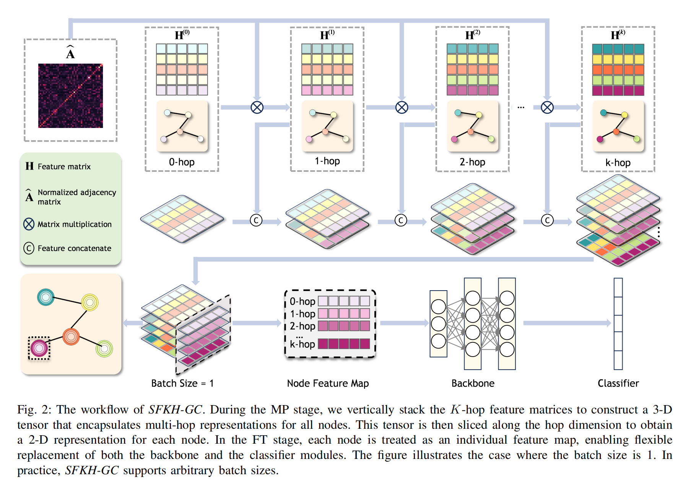

# SFKH-GC

**SFKH-GC: Harnessing the Power of Full-Neighborhoods Information for Large-Scale Attributed-Graph Learning**.

## Requirements

absl-py==1.4.0
aiohttp==3.9.3
aiohttp-cors==0.7.0
aiosignal==1.3.1
annotated-types==0.6.0
anyio==3.7.1
argon2-cffi==21.3.0
argon2-cffi-bindings==21.2.0
arrow==1.2.3
asttokens==2.2.1
async-timeout==4.0.3
atomman==1.4.10
attrs==23.1.0
backcall==0.2.0
beautifulsoup4==4.12.2
bibtexparser==1.4.1
bleach==6.0.0
blinker==1.8.1
cachetools==5.3.0
cdcs==0.2.2
certifi==2024.2.2
cffi==1.15.1
cftime==1.6.4.post1
chardet==4.0.0
charset-normalizer==2.1.1
click==8.1.7
colorama==0.4.6
colorful==0.5.6
comm==0.1.3
contourpy==1.0.7
cycler==0.11.0
Cython==3.0.8
d2l==0.17.6
DataModelDict==0.9.9
debugpy==1.6.7
decorator==5.1.1
defusedxml==0.7.1
dgl==0.9.1
distlib==0.3.8
dnspython==2.6.1
docker-pycreds==0.4.0
et-xmlfile==1.1.0
eval_type_backport==0.2.2
exceptiongroup==1.1.2
executing==1.2.0
faiss==1.7.4
faiss-cpu==1.11.0
fastjsonschema==2.17.1
filelock==3.13.4
Flask==3.0.3
Flask-Uploads==0.2.1
fonttools==4.39.4
fqdn==1.5.1
frozenlist==1.4.0
fsspec==2023.12.1
ftfy==6.2.0
gdown==5.1.0
gitdb==4.0.12
GitPython==3.1.44
google-api-core==2.18.0
google-auth==2.18.0
google-auth-oauthlib==1.0.0
googleapis-common-protos==1.63.0
grpcio==1.54.0
h5py==3.10.0
habanero==1.2.6
hdf5storage==0.1.19
huggingface-hub==0.21.3
idna==2.10
imageio==2.34.0
importlib-metadata==6.6.0
importlib-resources==5.12.0
ipykernel==6.24.0
ipython==8.14.0
ipython-genutils==0.2.0
ipywidgets==8.0.7
isoduration==20.11.0
itsdangerous==2.2.0
jedi==0.18.2
Jinja2==3.1.2
joblib==1.3.2
jsonpointer==2.4
jsonschema==4.18.3
jsonschema-specifications==2023.6.1
jupyter==1.0.0
jupyter-console==6.6.3
jupyter-events==0.6.3
jupyter_client==8.3.0
jupyter_core==5.3.1
jupyter_server==2.7.0
jupyter_server_terminals==0.4.4
jupyterlab-pygments==0.2.2
jupyterlab-widgets==3.0.8
keras==3.3.2
kiwisolver==1.4.4
lazy_loader==0.3
littleutils==0.2.2
llvmlite==0.42.0
loguru==0.7.2
lxml==5.1.0
Markdown==3.4.3
markdown-it-py==3.0.0
MarkupSafe==2.1.2
matplotlib==3.5.1
matplotlib-inline==0.1.6
mdurl==0.1.2
mistune==3.0.1
mkl-service==2.4.0
ml-dtypes==0.4.0
mpmath==1.2.1
msgpack==1.0.7
multidict==6.0.5
munch==4.0.0
munkres==1.1.4
namex==0.0.8
nbclassic==1.0.0
nbclient==0.8.0
nbconvert==7.6.0
nbformat==5.9.1
nest-asyncio==1.5.6
netCDF4==1.7.2
networkx==3.0
notebook==6.5.4
notebook_shim==0.2.3
numba==0.59.0
numericalunits==1.25
oauthlib==3.2.2
ogb==1.3.6
opencensus==0.11.4
opencensus-context==0.1.3
opencv-python==4.7.0.72
openpyxl==3.1.2
opt-einsum==3.3.0
optree==0.11.0
outdated==0.2.2
overrides==7.3.1
pandas==2.2.3
pandocfilters==1.5.0
parso==0.8.3
patsy==1.0.1
pickleshare==0.7.5
Pillow==9.3.0
platformdirs==4.2.1
potentials==0.3.7
pretrainedmodels==0.7.4
prometheus-client==0.17.1
prompt-toolkit==3.0.39
proto-plus==1.23.0
protobuf==4.23.0
psutil==5.9.5
pure-eval==0.2.2
py-spy==0.3.14
pyarrow==6.0.1
pyasn1==0.5.0
pyasn1-modules==0.3.0
pycparser==2.21
pydantic==2.7.1
pydantic_core==2.18.2
Pygments==2.15.1
pymongo==4.6.2
pyparsing==3.0.9
pyro-api==0.1.2
pyro-ppl==1.9.0
PySnooper==1.2.0
PySocks==1.7.1
python-dateutil==2.8.2
python-json-logger==2.0.7
python-mnist==0.7
pytorch-fid==0.3.0
pytorch-ignite==0.5.0.post2
pytorch-metric-learning==2.5.0
pytorch-msssim==1.0.0
pytz==2023.3
pywin32==306
pywinpty==2.0.11
PyYAML==6.0
pyzmq==25.1.0
qtconsole==5.4.3
ray==2.10.0
referencing==0.29.1
regex==2023.12.25
requests==2.25.1
requests-oauthlib==1.3.1
rfc3339-validator==0.1.4
rfc3986-validator==0.1.1
rich==13.7.1
rpds-py==0.8.10
rsa==4.9
safetensors==0.4.2
scikit-image==0.22.0
scikit-learn==1.3.1
scipy==1.10.1
seaborn==0.12.2
Send2Trash==1.8.2
sentry-sdk==2.19.2
setproctitle==1.3.4
six==1.16.0
smart-open==7.0.4
smmap==5.0.2
sniffio==1.3.0
soupsieve==2.4.1
stack-data==0.6.2
statsmodels==0.14.4
sympy==1.11.1
tensorboard==2.13.0
tensorboard-data-server==0.7.0
tensorboardX==2.6.2.2
terminado==0.17.1
thop==0.1.1.post2209072238
threadpoolctl==3.2.0
tifffile==2024.2.12
timm==0.9.16
tinycss2==1.2.1
tokenizers==0.15.2
toolz==0.12.1
torch==2.0.1+cu117
torch-scatter==2.1.2+pt20cu117
torch-sparse==0.6.18+pt20cu117
torch_geometric==2.5.0
torchaudio==2.0.2+cu117
torchdata==0.7.1
TorchSnooper==0.8
torchvision==0.15.2+cu117
tornado==6.3.2
tqdm==4.65.0
traitlets==5.9.0
transformers==4.38.2
typing_extensions==4.11.0
tzdata==2023.3
Unidecode==1.3.8
uri-template==1.3.0
urllib3==1.26.13
virtualenv==20.26.0
wandb==0.19.1
wcwidth==0.2.13
webcolors==1.13
webencodings==0.5.1
websocket-client==1.6.1
Werkzeug==3.0.2
widgetsnbextension==4.0.8
win32-setctime==1.1.0
wrapt==1.16.0
xarray==2024.7.0
xlrd==2.0.1
xmltodict==0.13.0
yabadaba==0.2.1
yacs==0.1.8
yarl==1.9.4
zipp==3.15.0
dgl == 0.9

## Hyperparameter Settings

The hyperparameter settings for the `SFKH-GC+Vanilla MLP` model on the four small-scale datasets are summarized below. While most training parameters were kept consistent, the propagation depth ($K$) and the MLP's hidden dimension were tuned on a per-dataset basis.

| Hyperparameter | Cora | PubMed | Photo | Computer |
| :--- | :--- | :--- | :--- | :--- |
| **Propagation Hops ($K$)** | 6 | 5 | 11 | 6 |
| **MLP Hidden Dimension** | 128 | 256 | 256 | 256 |
| Batch Size | 1000 | 1000 | 1000 | 1000 |
| Epochs | 200 | 200 | 200 | 200 |
| Optimizer | Adam | Adam | Adam | Adam |
| &nbsp;&nbsp;&nbsp;- $\beta_1, \beta_2$ | (0.9, 0.999) | (0.9, 0.999) | (0.9, 0.999) | (0.9, 0.999) |
| Peak Learning Rate | 0.001 | 0.001 | 0.001 | 0.001 |
| End Learning Rate | 0.0001 | 0.0001 | 0.0001 | 0.0001 |
| Weight Decay (L2) | 1e-5 | 1e-5 | 1e-5 | 1e-5 |
| Warmup Updates | 400 | 400 | 400 | 400 |
| Total Updates | 1000 | 1000 | 1000 | 1000 |
| Early Stopping Patience | 50 | 50 | 50 | 50 |

## How to Run

To train and evaluate the model, use the `train.py` script

For datasets, you can download them from https://figshare.com/s/5791ccd4c565843f70c6

